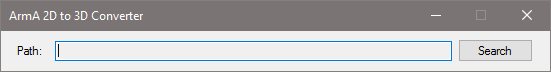

# ArmA2 2D to 3D Converter

  

### Funktionen:
- Einfache Bedienung.
- Open Source!

### Installation:
- Keine. Das Programm kann sofort ohne Installation gestartet und benutzt werden.

### Anforderung:
- 1GHz CPU.
- 32MB freier Arbeitsspeicher.
- 1MB freier Festplattenspeicher.
- .NET Framework 4.0
- Unterstützte Betriebssysteme:Windows XP, Vista, 7, 8

### Unterstützte Sprachen:
- Englisch

## Geschichte
Dieses Tool ist aus dem Bedarf entstanden kleine Objekte umplazieren zu können. Für ArmA 2 gab es zwar viele "3D zu 2D Converter", aber kein einzigen "2D zu 3D Converter". Mit diesem Tool kann man nun zu 2D und 3D hin und her convertieren wie oft man will, um kleine Objekte zu positionieren.
